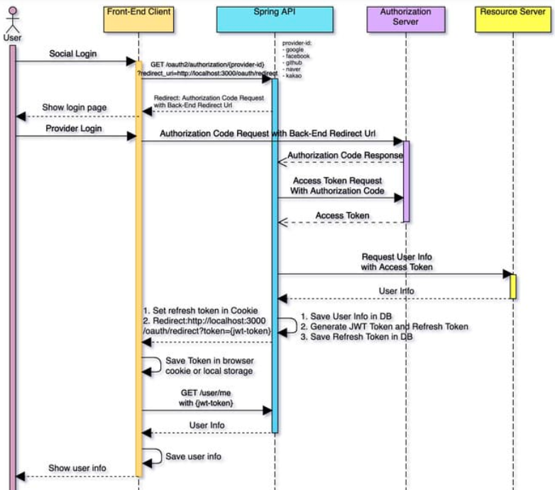

# Login google

소셜로그인을 구현하는 방식
 - only front를 사용해서 구현하는 방식
 - only back을 사용해서 구현하는 방식
 - front + back 을 혼합해서 사용하는 방식

위 세 가지 방식이 존재합니다.
많은 프로젝트가 단일로 기술로 구현하기에 한계점이 있다고 생각합니다.

기술 : React(SPA), spring boot, srping security, OAuth2.0, JWT를 사용하는 사람들에게 유익한 방법이라고 생각합니다 .

### 시퀀스 다이어그램

저는 front + back 을 혼합해서 사용하는 방식에 대해서 자료를 찾아보았다.

### 구글 소셜로그인 구현해보기
현재 구현해야하는 방식은 front와 back을 혼합하여 소셜로그인을 구현하는 방식

